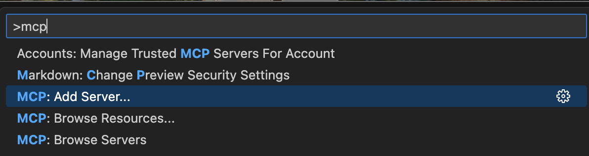
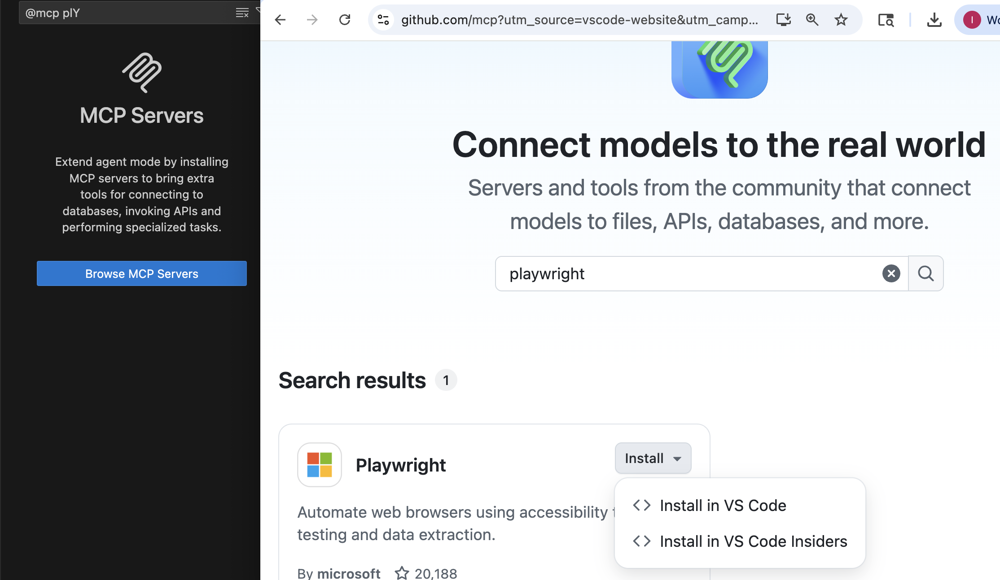

# Context Gathering

I did everything from the `2. Requirements` version.  As a reminder, that's this:

1. I used voicepal to transcribe my thoughts for the app.  
2. I then gave that to copilot (GPT-5) and asked it to ask me questions that it would need to know to create a requirements plan based on that.  
3. I then transcribed more.  
4. I asked claude 4.5 to put that into a plan. 
5. I read it and saw it misunderstood the structure
6. I found a blog post about it that I liked, and used the Jina AI reader to conver to markdown
7. I used that as context to improve the plan

Then I also added these additional steps for this better context version:

1. Added playwright MCP server.
2. Added git MCP server for air.
3. Gave some details on how to use tools and files in the AGENTS.md
4. Decided to use claude code for parts of it, made a symlink from `CLAUDE.md` to `AGENTS.md` so I didn't have to have duplicate context
5. Turned `plan.md` into a step by step progression I could work through one at a time.
6. Had the agent complete 1 todo at a time, checking and screenshotting with playwright.  I reviewed code before committing, then moved to each todo
7. Once all done did another refactoring pass.  Starting with creating a `refactor.md`, then went through every line of code manually for review and edits.

## Adding MCP Servers

Each tool has a slightly different way.  For the two I used

### Claude Code

`claude mcp add playwright npx @playwright/mcp@latest`
`claude mcp add air-docs npx mcp-remote https://gitmcp.io/feldroy/air` 

### Github copilot

