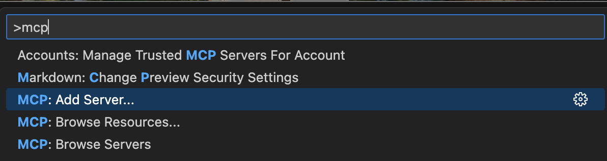

# Extra Context

1. Added playwright MCP server.  You can do this with claude code:

`claude mcp add playwright npx @playwright/mcp@latest`

Or github copilot:

2. Added git MCP server for air.

`claude mcp add air-docs npx mcp-remote https://gitmcp.io/feldroy/air` 

3. I added a symlink from `CLAUDE.md` to `AGENTS.md` so it works with both agents `ln -s AGENTS.md CLAUDE.md`

