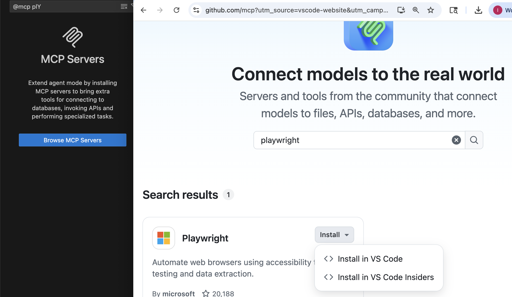

# Elite AI Assisted Coding Homework

We're building a SaaS app to help writers outline short stories using Orson Scott Card's "MICE Quotient" structure.

## Why Short Stories

We thought about making the assignments based on something like a SaaS todo app. We felt we wanted to replicate what it might be like to code an actual product. This fills that need because:

1. Real products have some complexity that they are solving that isn't solved 10,000 times before
2. I know it's a real product, because it's part of a real product i'm building! (You're totally free to do anything with this, even release your own product!)
3. Like a real product, you might have to learn a bit about how it's supposed to work while you create it.

## Homework Structure

Each assignment directory has its own `ASSIGNMENT_OVERVIEW.md` file and `ASSIGNMENT_CONCISE.md`. That file will include:

1. Information about the homework
2. Variety of options for scaling difficulty up and down

You have lifetime access. My recommmendation is start with the simplest ones and focus on doing them phenomenally well. Then slowly build up in complexity. If that takes you 2 weeks or 2 months or 6 months that's fine!

## Why Air?

Air is a FastAPI-based web framework by Daniel and Audrey Roy Greenfeld.

Why I'm using it:

1. Built on FastAPI—proven foundation
2. New — minimal training data. You'll work with context, not memorization.
3. I like it. Use what works for you. If Air doesn't work for you, do all the assignments in your framework of choice.

## Why Something New?

Real work involves internal libraries, private repos, and code that's not in training data.

Learning with tools that don't have significant representation in the training data builds those skills.

## Context Gathering

### How to run

1. Set up python
2. Install [uv](https://docs.astral.sh/uv/getting-started/installation/)
3. `cd` into the app directory and run with `uv run fastapi dev`

### Context Gathering Process

I did everything from the `2. Requirements` version. As a reminder, that's this:

1. I used voicepal to transcribe my thoughts for the app.  
2. I then gave that to copilot (GPT-5) and asked it to ask me questions that it would need to know to create a requirements plan based on that.  
3. I then transcribed more.  
4. I asked claude 4.5 to put that into a plan. 
5. I read it and saw it misunderstood the structure
6. I found a blog post about it that I liked, and used the Jina AI reader to conver to markdown
7. I used that as context to improve the plan

Then I also added these additional steps for this better context version:

1. Added playwright MCP server.
2. Added git MCP server for air.
3. Gave some details on how to use tools and files in the AGENTS.md
4. Decided to use claude code for parts of it, made a symlink from `CLAUDE.md` to `AGENTS.md` so I didn't have to have duplicate context
5. Turned `plan.md` into a step by step progression I could work through one at a time.
6. Had the agent complete 1 todo at a time, checking and screenshotting with playwright. I reviewed code before committing, then moved to each todo
7. Once all done did another refactoring pass. Starting with creating a `refactor.md`, then went through every line of code manually for review and edits.

### Adding MCP Servers

Each tool has a slightly different way. For the two I used

#### Claude Code

`claude mcp add playwright npx @playwright/mcp@latest`

`claude mcp add air-docs npx mcp-remote https://gitmcp.io/feldroy/air` 

#### Github copilot

